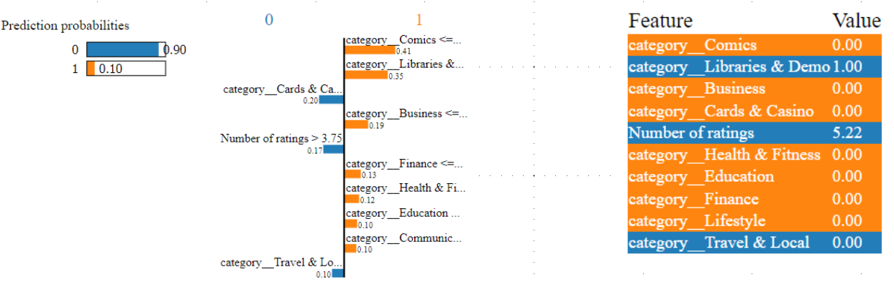
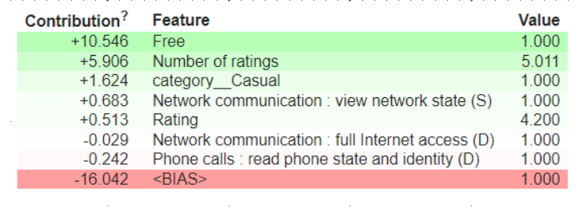

 
# Android Authtentivcity Prediction
Android has lately been a popular operating system for most smartphone users. Due to this it is also popular for having applications that can be used for malicious activities.That is why it is important to predict if an app is malware or benign.

# Problem Description:
This dataset consists of apps needed permissions during installation and run-time. We collect apps from three different sources google play, third-party apps and malware dataset. This file contains more than 30,000 Android apps. features extracted at the time of installation and execution. One file contains the name of the features and others contain .apk file corresponding to it extracted permissions with respective package. Apps are collected from Google's play store, hiapk, app china, Android, mumayi , gfan slideme, and pandaapp. These .apk files collected from the last three years continuously and contain 81 distinct malware families. But, Here you are only supposed to predict whether the app is benign(0) or malware(1).

# Attribute Information (10 out of 184 columns):
  * App :- Name of the App
  * Package :- OBB/Data package installed in root folder
  * Category :- App Category (eg. Entertainment, Adventure, puzzle, Action, Antivirus, etc.)
  * Description :- App Description
  * Rating :- Rating out of 5
  * Number of ratings :- No. of Ratings given by users
  * Price :- Price of the App
  * Related apps :- Apps related to installed App
  * Dangerous (D) permissions count :- No. of Dangerous Permissions allowed by user
  * Safe (S) permissions count :- No. of Safe Permissions allowed by user
# Libraries:
  * Pandas
  * Numpy
  * Matplotlib
  * Seaborn
  * Scikit-learn
  
# Algorithms:
  * Logistic Regression
  * Decision tree
  * Random Forest
  * Gradient Boost
  * KNN
  * Naive Bayes
  * XGBoost

# Best Model:
  We use F1 score to find our best model beacuse our dataset is slightly imbalanced and there is a serious downside to predicting false negatives. Base on F1 score Logistic Regression gives the best result of ~91% for train and test.
 # Model Explainability:
 We will explian our model using LIME (Local Interpretable Model-Agnostic Explanations) & ELI5 (Explain like I'm 5)
 ## LIME
  
 ## ELI5
  
